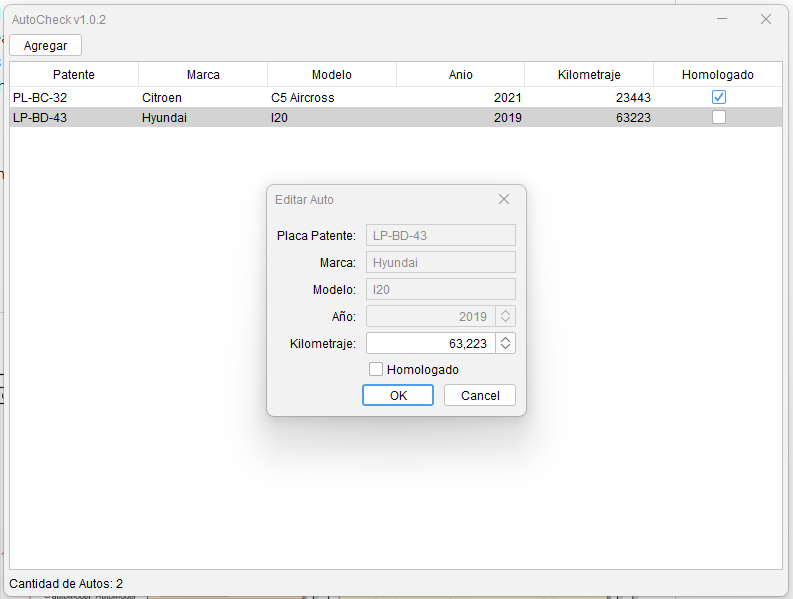
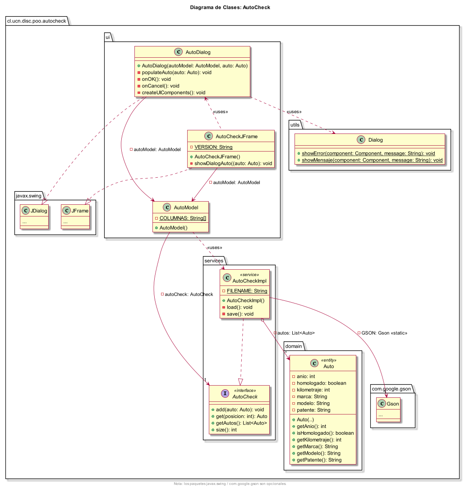

# The AutoCheck Project

## Description

The homologation process, carried out at the Vehicle Control and Certification Center of the MTT (3CV), consists of a technical analysis of motor vehicles whose models are intended to be marketed in the country. This analysis allows verifying that they meet all current regulatory requirements: emissions, dimensional, functional, and with special emphasis on the safety measures they have, depending on their category. Thanks to this, for example, it is possible to ensure that a model that is going to be in circulation complies with key aspects, ranging from the braking system to the use of stabilization technologies. And also with elements that may seem more basic, such as lighting, among others.

The software development company BADCODE has started the construction of the AutoCheck system that will maintain a record of all vehicles that have been marketed in the city of Antofagasta, however, it has left the project half-built.

## Class diagram

## Tools

- **Language**: [Java 17](https://jdk.java.net/): Java is the #1 programming language and development platform. It
  reduces costs, shortens development timeframes, drives innovation, and improves application services.
- **Libraries**:
    - [Google Gson](https://github.com/google/gson): Gson is a Java library that can be used to convert Java Objects
      into their JSON representation. It can also be used to convert a JSON string to an equivalent Java object.
    - [FlatLaf](https://github.com/JFormDesigner/FlatLaf): FlatLaf is a modern open-source cross-platform Look and Feel
      for Java Swing desktop applications.

## Credits

- [Mg. Diego Urrutia-Astorga](http://godie.cl), [Departamento de Ingeniería de Sistemas y Computación](http://www.disc.ucn.cl), [Universidad Católica del Norte](http://wwww.ucn.cl),
  Antofagasta, Chile.

## License

 This project is open-sourced software licensed under the [MIT license](LICENSE.md).
